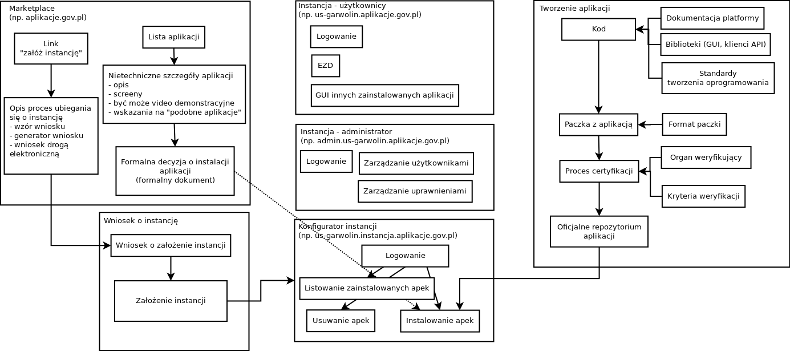

Obszary Platformy
=================

   Schemat obszarów Platformy.

Marketplace
-----------

Marketplace jest witryną internetową na której prezentowane są aplikacje
dostępne w ramach Platformy. Zawiera też instrukcję ubiegania się o
założenie nowej instancji oraz odnośniki do innych obszarów Platformy
(np. zakładka "Dla twórców aplikacji").

Marketplace może zawierać funkcję logowania się na "konto instytucji" -
dzięki temu wyświetlane informacje mogą być dobrane w oparciu o szerszy
kontekst (np. typ instytucji, informacje o działającej instancji).

W oparciu o opis aplikacji organ decyzyjny w danej instytucji może
podjąć formalną decyzją o zainstalowaniu danej aplikacji na instancji
danej instytucji. Sama instalacja aplikacji nie jest przeprowadzana
przez Marketplace ani też przez organ decyzyjny - instalacja jest
wykonywana przez administratora.

Wniosek o założenie instancji
-----------------------------

Zakładanie nowej instancji odbywa się przez złożenie wniosku do podmiotu
zarządzającego chmurą. Najprostszym do realizacji sposobem jest
składanie wniosku jako dokumentu. Innym sposobem jest stworzenie
dedykowanego systemu do składania wniosków drogą elektroniczną.

W najprostszej wersji wnioski są rozpatrywane nieautomatycznie.
Administratorzy chmury zakładają nowe instancje być może wspomagając się
różnymi narzędziami, jednak proces nie jest w pełni automatyczny.

Proces może zostać zautomatyzowany przez stworzenie odpowiedniego
systemu. Np. weryfikacja może opierać się na sprawdzeniu czy konto ePUAP
z którego nadszedł wniosek jest kontem instytucji o odpowiednich
parametrach. Zakładanie instancji może polegać na uruchomieniu w pełni
automatycznych skryptów.

Instancja
---------

Konfigurator instancji
~~~~~~~~~~~~~~~~~~~~~~

Konfigurator instancji jest aplikacją WWW, za pomocą której
administrator konkretnej instytucji może zainstalować i skonfigurować
aplikacje na instancji. Robi to w oparciu o decyzję organu decyzyjnego
instytucji.

Dostęp administratora
~~~~~~~~~~~~~~~~~~~~~

Pewne akcje administracyjne w systemie nie są konfiguracją instancji.
Np. zarządzanie użytkownikami i ich uprawnieniami. Takie akcje mogą być
wykonane przez oddzielny interfejs administratora.

Dostęp dla użytkowników
~~~~~~~~~~~~~~~~~~~~~~~

Użytkownicy korzystają z aplikacji zainstalowanych na instancji.

Tworzenie aplikacji
-------------------

Twórcy aplikacji, w oparciu o zasoby takie jak biblioteki i standardy,
tworzą paczki z aplikacjami. Aby paczka z aplikacją znalazła się w
oficjalnym repozytorium i mogła być zainstalowana na instancjach musi
przejść przez proces certyfikacji.
